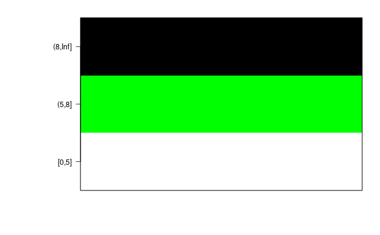
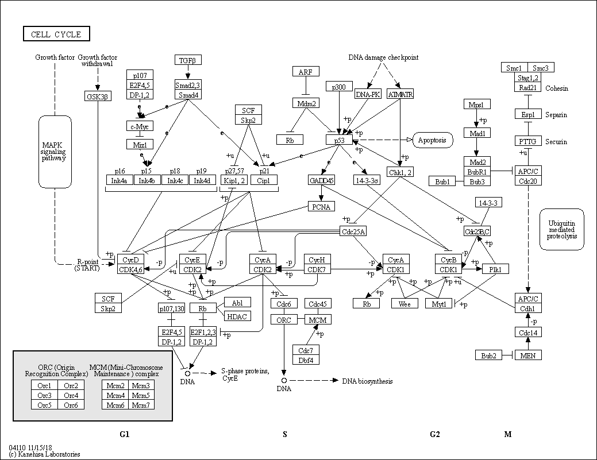
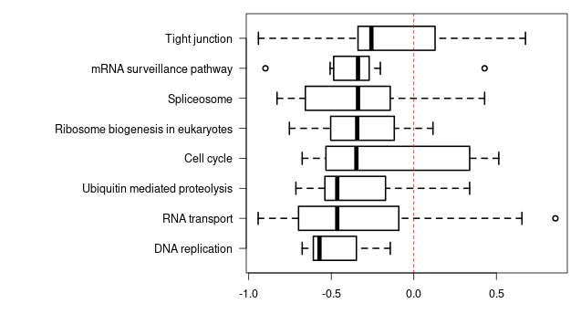
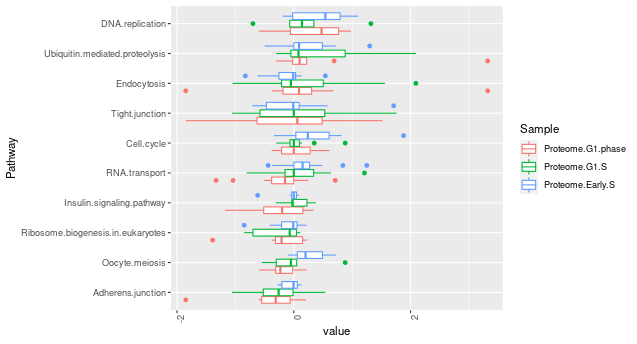
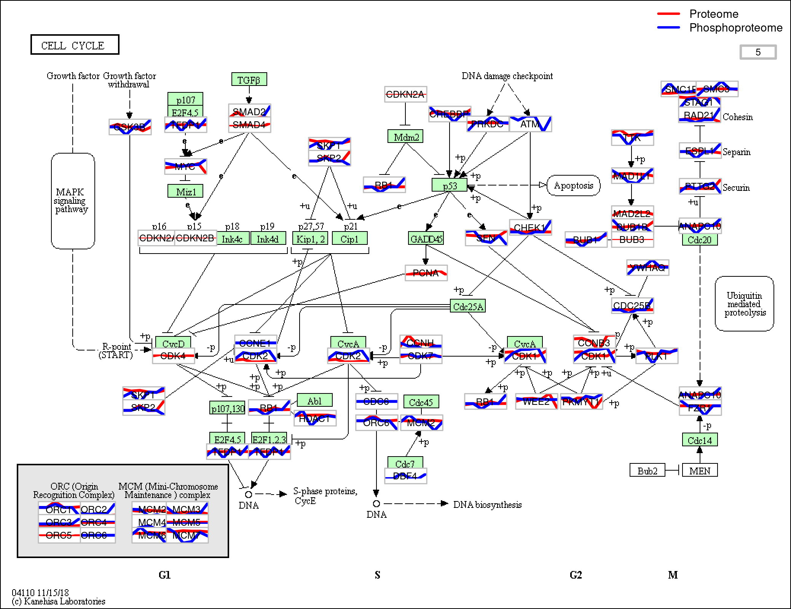

# BIOC包：'KEGGprofile'

> 标题：在KEGG通路中用于多重类型(multi-types)和多组数据(multi-groups)的**注释和可视化**包。
>
> 维护者：Shilin Zhao shilin.zhao@vanderbilt.edu
>
> 描述：KEGGprofile是一个注释和可视化工具，能够将表达谱和功能注释集成在KEGG通路图中。 多类型和多组表达数据可以在一个通路图中可视化。 KEGGprofile提供了关于不同基因和样品中特定功能改变内部途径或时间相关性的更详细的分析。
>
> 首页地址：https://www.bioconductor.org/packages/release/bioc/html/KEGGprofile.html

[TOC]

## API documents

### fun: col_by_value

> 该函数会将数据矩阵转换为颜色矩阵，其中颜色表示数字矩阵的值。

函数定义如下：

~~~R
function(x, col, range = NA, breaks = NA, showColorBar = T)
    # x - matrix: 表示value的数字矩阵
    # col - vector: 用于表示value的颜色列表
    # range - vector: 设置value的范围，超出范围的将被截取
    # breaks - vector: 指定对x进行分割的数值向量。
    # showColorBar - logical: 是否显示颜色条
~~~

**注意**：若`breaks`不等于`NA`，则`col`的长度应该等于`breaks-1`，表示按照指定区间填充颜色。

**Value**: 该函数返回值是x矩阵对应的颜色矩阵。该矩阵可以在'plot_profile'函数中使用。

Sample:

~~~R
data(pho_sites_count) # pho_sites_count是一个6374*1的Double矩阵
head(pho_sites_count)
#    pho.sites.number
#2                 1
#16                5
#20                1
#22                5
#23                8
#27                9
head(rownames(pho_sites_count))
#[1] "2"  "16" "20" "22" "23" "27"
col <- col_by_value(x = pho_sites_count, col = c('white', 'green', 'black'), breaks = c(0, 5, 8, Inf))
head(col)
#   [,1]
#2  "white"
#16 "white"
#20 "white"
#22 "white"
#23 "green"
#27 "black"
~~~

生成的颜色区间图

### fun: convertId

> 基于'biomatRt'包的ID映射函数

函数定义如下：

~~~R
function(x, dataset = "hsapiens_gene_ensembl", filters = "uniprotswissprot", attributes = c(filters, "entrezgene_id"), genesKept = c("foldchange", "first", "random", "var", "abs"), keepNoId = T, keepMultipleId = F, verbose = F)
    # x - matrix: 表达式矩阵
    # dataset - str: 使用的数据集名称
    # filters - str or list: 设置过滤器，查看所有的过滤器可用函数`biomaRt::listFilters()`
    # attributes - vector: 您要检索的属性。 可以使用`biomaRt::listAttributes()`函数检索可能的属性列表
    # genesKept - str: 在一个以上的目标中选择目标基因的方法。 “var”-最大变化，“foldchange”-倍数变化，“abs”-绝对值变化，“first”-选择第一目标，“random”-随机选择
    # keepNoId - logical: 是否保留原ID
    # keepMultipleId - logical: 保留多个ID与原ID的相关性
    # verbose - logical: 是否报告进度相关信息
~~~

Sample:

~~~R
temp <- cbind(rnorm(10), rnorm(10)) # matrix 10*2
row.names(temp) <- c("Q04837", "P0C0L4", "P0C0L5", "O75379", "Q13068",
                     "A2MYD1", "P60709", "P30462", "P30475", "P30479")
colnames(temp) <- c('Exp1', 'Exp2')
head(temp)
#              Exp1        Exp2
#Q04837 -0.49204685 -0.71231288
#P0C0L4 -0.07584076  0.67255037
#P0C0L5 -0.59569305 -0.71189653
#O75379  1.84496906  1.67716858
#Q13068 -0.90369581  0.08408228
#A2MYD1 -0.81876488  0.35165130
convertId(temp, keepMultipleId = T, verbose = T)
# Not run
~~~

### fun: download_KEGGfile

> 此方法将从KEGG站点下载XML文件和原始png文件

~~~R
function(pathway_id = "00010", species = "hsa", target_dir = getwd())
    # pathway_id - str: 通路ID
    # species - str: 物种简称
    # target_dir - str: 本地路径
~~~

**注意**：若`pathway_id	`设置为'all'表示下载KEGG数据库中的全部通路数据。

Sample:

~~~R
download_KEGGfile(pathway_id = '04110', species = 'hsa') # download_KEGGfile(pathway_id = '04110', species = 'hsa')
~~~

### fun: download_latest_pathway

> 该方法会从KEGG站点下载最新的通路基因链接(pathway gene link)

~~~R
function(species)
    # species - str: 物种名称简称
~~~

**Value** - list: 该函数会返回两部分数据。

- keggpathway2gene - 描述每条通路的基因列表
- pathway2name - 描述每条通路的名称列表

### fun: find_enriched_pathway

> 该功能将在KEGG通路数据库中绘制基因图谱，然后使用超几何学测试来估计每种通路的富集意义。

~~~R
function(gene, species = "hsa", returned_pvalue = 0.01, returned_adjpvalue = 0.05, returned_genenumber = 5, download_latest = FALSE, refGene = NULL) 
    # gene - matrix
    # species - str: 物种名称简称
    # returned_pvalue - number: 富集通路的最小p值
    # returned_adjpvalue - number: 富集通路的最小调整p值
    # returned_genenumber - number: 富集通路的最小注释基因数
    # download_latest - logical: 该函数是否从KEGG网站下载最新的途径/基因链接。由于KEGG策略更改导致KEGG.db软件包很长时间没有更新，因此我们提供了此参数，以便用户可以获取最新的KEGG数据库。
    # refGene - number: 用作参考的基因名称。如果未提供，将使用KEGG数据库中的所有基因。
~~~

**注意**：只有在超几何测试中p值\<=`returned_pvalue`并且注释基因数\>=`returned_genenumber`的才会被认为是富集的并返回。

**Value** - list: `stastic`-matrix：其中包含富集途径的途径ID，名称，p值，注释基因的数量；`detail`-list: 包含每条通路基因注释的列表。

Sample:

~~~R
data(pho_sites_count)
head(pho_sites_count)
#    pho.sites.number
#2                 1
#16                5
#20                1
#22                5
#23                8
#27                9
genes <- names(rev(sort(pho_sites_count[, 1]))[1:300])
head(genes)
#[1] "23524" "10250" "4288"  "79026" "7158"  "85456"
pho_KEGGresult <- find_enriched_pathway(genes, species = 'hsa')
head(pho_KEGGresult$stastic)
#        Pathway_Name Gene_Found Gene_Pathway Percentage       pvalue    pvalueAdj
#03013 RNA transport         17          152       0.11 9.057606e-13 2.074192e-10
#03040   Spliceosome         13          128       0.10 1.247701e-09 1.428618e-07
head(pho_KEGGresult$detail)
# $`03013`
# [1] "10250"  "11218"  "129401" "1975"   "1978"   "1981"   "22985"  "4928"
# [9] "5411"   "55746"  "57122"  "57187"  "5903"   "7175"   "8021"   "9669"
# [17] "9972"
# $`03040`
# [1] "10772" "10992" "22985" "23350" "23451" "27316" "29896" "3183"  "3192"
# [10] "55119" "57187" "6432"  "6434"
~~~

### fun: newIdMatrix

> ID转换

~~~R
function(x, convertIdTable, genesKept = c("var", "foldchange", "abs", "first", "random"))
    # x - matrix: 表达矩阵
    # convertIdTable - vector: 名称应为源ID，值应为目标ID。
    # genesKept - str: 在一个以上的目标中选择目标基因的方法。 “var”-最大变化，“foldchange”-倍数变化，“abs”-绝对值变化，“first”-选择第一目标，“random”-随机选择
~~~

**Value** - matrix: 转换后的矩阵

Sample:

~~~R
convertIdTable <- paste("New", c(1, 2, 2, 2, 1, 3, 4, 4, 5, 5))
names(convertIdTable) <- paste("Old", seq_along(convertIdTable))
head(convertIdTable)
#  Old 1   Old 2   Old 3   Old 4   Old 5   Old 6
#"New 1" "New 2" "New 2" "New 2" "New 1" "New 3"
temp <- matrix(rnorm(20), ncol = 2)
row.names(temp) <- names(convertIdTable)
colnames(temp) <- c("Exp1", "Exp2")
head(temp)
#            Exp1        Exp2
#Old 1 -0.9084028  0.18392728
#Old 2  1.1840826  0.64861437
#Old 3  1.3898440  0.50067203
#Old 4 -0.2399096  0.62827512
#Old 5  0.8192186 -0.55391576
#Old 6 -0.3073348  0.09491983
new_temp <- newIdMatrix(temp, convertIdTable, genesKept = "foldchange")
new_temp
#            Exp1        Exp2
#New 1  0.8192186 -0.55391576
#New 2  1.3898440  0.50067203
#New 3 -0.3073348  0.09491983
#New 4 -0.6787377 -0.05339891
~~~

### fun: parse_XMLfile

> 该函数将会解析KGML文件

~~~R
function(pathway_id, species, database_dir = getwd())
    # pathway_id - str: 通路ID
    # species - str: 物种名称简称
    # database_dir - str: 本地XML文件和png文件路径
~~~

**Value** - matrix: 包含此途径中的基因及其名称位置等的矩阵，可在函数`plot_profile`中用作`KEGG_database`的参数。

Sample:

~~~R
gene_data <- parse_XMLfile(pathway_id = '04110', species = 'hsa')
head(gene_data)
#      [,1]    [,2]  [,3]  [,4] [,5] [,6]
#[1,] "1029"  "532" "124" "46" "17" "CDKN2A"
#[2,] "51343" "919" "536" "46" "17" "FZR1"
#[3,] "4171"  "553" "556" "46" "17" "MCM2"
#[4,] "4172"  "553" "556" "46" "17" "MCM2"
#[5,] "4173"  "553" "556" "46" "17" "MCM2"
#[6,] "4174"  "553" "556" "46" "17" "MCM2"
~~~

### fun: plot_pathway

> 函数`download_KEGGfile`，`parse_XMLfile`和`plot_profile`的封装

### fun: plot_pathway_cor

> 该函数将绘制每个富集途径的相关分布（`find_enriched_pathway`函数的结果），然后将使用Wilcoxon检验来估计每个途径中的基因与所有基因之间的相关性分布的重要性。

~~~R
function(gene_expr, kegg_enriched_pathway, groups = NULL, side = c("both", "pos", "neg"), alternative = NULL)
    # gene_expr - matrix: 基因表达矩阵，rownames必须是NCBI基因ID，例如67040, 93683
    # kegg_enriched_pathway - list: `find_enriched_pathway`函数的返回值
    # roups - str or vector: 用于指示不同样本的表达式的字符
    # side - str: 指示感兴趣的相关性，"both", "pos", "neg"三选一
    # alternative - str: 指定可选假设的字符串，必须是“two.sided”（默认），“greater”或“less”之一，可以仅指定首字母。
~~~

**Value**: p values for Wilcoxon tests in each pathway

Sample:

~~~R
data(pro_pho_expr)
data(pho_sites_count)
genes <- row.names(pho_sites_count)[which(pho_sites_count >= 10)]
pho_KEGGresult <- find_enriched_pathway(genes, species = 'hsa')
result <- plot_pathway_cor(gene_expr = pro_pho_expr, kegg_enriched_pathway = pho_KEGGresult)
head(result)
#                   DNA replication                     RNA transport
#                       0.08767729                        0.07181928
#   Ubiquitin mediated proteolysis                        Cell cycle
#                       0.29992077                        0.72446442
#Ribosome biogenesis in eukaryotes                       Spliceosome
#                       0.43376060                        0.05778624
~~~

### fun: plot_pathway_overall

> 该函数将绘制每个富集途径的相关分布（`find_enriched_pathway`函数的结果），然后将使用Wilcoxon检验来估计每个途径中的基因与所有其他基因之间的值分布的重要性。

~~~R
function(gene_values, species = "hsa", pathwayNumInFigure = 5, rankByVar = colnames(gene_values)[1]) 
    # gene_values - data.frame or matrix: 行名是gene ID，列代表每种条件下的基因值
    # species - str: 物种名称简称
    # pathwayNumInFigure - number: 指定箱线图中每个方向上（顶部）路径的最大数量。
    # rankByVar - str: 指定变量（样本）名称，以此对箱形图进行排名
~~~

**Value** : p values for Wilcoxon tests in each pathway

Sample:

~~~R
data(pro_pho_expr)
data(pho_sites_count)
gene_values <- pro_pho_expr[row.names(pho_sites_count)[which(pho_sites_count >= 10)],]
plot_pathway_overall(gene_values = gene_values[, 1:3])
~~~

### fun: plot_profile

> 在KEGG通路图上绘制基因表达谱

~~~R
function(gene_expr, pathway_name, result_name = paste(pathway_name, "_profile_", type, ".png", sep = ""), KEGG_database, groups, bg_col = "white", text_col = "black", line_col, border_col = "grey", text_cex = 0.25, magnify = 1, type = c("lines", "bg"), pathway_min = 5, genes_kept = c("foldchange", "first", "random", "var", "abs"), species = "hsa", database_dir = getwd(), max_dist, lwd = 1.2, speciesRefMap = TRUE)
    # gene_expr - matrix: 基因表达矩阵，rownames必须是NCBI基因ID，例如67040, 93683
    # pathway_name - str: 物种名和KEGG通路ID，例如’hsa00010’
    # result_name - str: 输出文件名
    # KEGG_database - matrix: 来自‘parse_XMLfile’函数的返回值
    # groups - str or vector: 用于指示不同样本的表达式的字符
    # bg_col - str: 通路图中基因矩形的背景色
    # text_col - str or matrix: 通路图中文本的颜色。在这里可以使用由函数'col_by_value'生成的颜色矩阵 
    # line_col - str or vector: 路线图中不同样本中用于表达的线条颜色，当type=“lines”时有效
    # border_col - str or matrix: 通路图中基因矩形的边框颜色。在这里可以使用由函数`col_by_value`生成的颜色矩阵
    # text_cex - number or matrix: 通路图中文本的CEX。在这里可以使用由函数`col_by_value`生成的颜色矩阵
    # magnify - number: 用于放大基因矩形的系数
    # type - str: 有两种表示基因表达谱的可视化方法：“bg”和“lines”。第一个仅适用于仅使用一个样本或一种类型的数据进行的分析，该分析将基因多边形划分为几个子多边形以代表不同的时间点。每个子多边形都有特定的背景颜色来表示该时间点的表达式变化。第二种方法在基因多边形中绘制具有不同颜色的线，以表示不同的样本或不同类型的数据。
    # pathway_min - number: 带注释的基因数少于path_min的途径将被忽略
    # genes_kept - str: 在一个以上的目标中选择目标基因的方法。 “var”-最大变化，“foldchange”-倍数变化，“abs”-绝对值变化，“first”-选择第一目标，“random”-随机选择
    # species - str: 物种名称简称
    # database_dir - str: 本地XML文件和png文件路径
    # max_dist - number: 表达式的变化表示为从基因矩形的底部到顶部的距离，当type=“lines”时有效。此参数用于确保不同基因多边形中的线的动态变化表示相同的变化。默认情况下，将从该途径中基因的最大变化计算得出。如果max_dist = NA，则将在每个基因矩形中从上到下绘制线条
    # lwd - number: line width
    # speciesRefMap - logical: 使用特定物种的图作为参考图。如果设置为FALSE，将使用没有物种信息的参考途径图
~~~

**Value** - matrix: 保存有该通路通路基因map、名称和表达的矩阵。

Sample:

~~~R
data(pro_pho_expr)
gene_data <- parse_XMLfile(pathway_id = '04110', species = 'hsa')
out <- plot_profile(pro_pho_expr, pathway_name = 'hsa04110',
                    line_col = c('red', 'blue'),
                    KEGG_database = gene_data,
                    groups = c(rep("Proteome ", 6), rep("Phosphoproteome ", 6)),
                    magnify = 1.2, max_dist = 5)
~~~

### data: pro_pho_expr

> 该数据集来自先前发表的不同细胞相中蛋白质组和磷酸化蛋白质组分析的数据。 在此data.frame中，列1-6是蛋白质组数据，列7-12是磷酸化蛋白质组数据。 这6个时间点是G1，G1 / S，早期S，晚期S，G2，有丝分裂。

### data: pho_sites_count

> 该数据集是一个`data.frame`，分析中每个基因的磷酸化位点数量均已量化。

~~~R
data(pho_sites_count)
head(pho_sites_count)
#    pho.sites.number
#2                 1
#16                5
#20                1
#22                5
#23                8
#27                9
~~~

