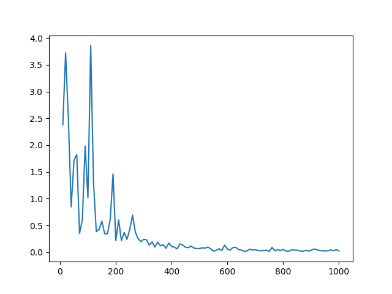

# Siamese Network(孪生网络)

[TOC]

## 孪生网络

孪生网络用用于解决两个输入的相似度计算。将两个输入feed in两个神经网络中。若两个网络权重相同，则用于比较同类输入的相似度，例如两张照片中的人是否是同一个。若两个网络不相同（也被称为伪孪生网络），则可用于比较输入类型不相同的数据，例如一个网络处理人名，一个网络处理照片。

## 损失函数

$$
L=\frac{1}{2N}\sum_{n-1}^{N}{yd^2}+\left(1-y\right){max{\left(margin-d,0\right)}}^2
$$

其中y表示相似(y=1)或者不相似(y=0)，margin是设置的阈值，d表示两个样本的欧氏距离。

## 数据集说明

ORL人脸数据集共包含40个不同人的400张图像，是在1992年4月至1994年4月期间由英国剑桥的Olivetti研究实验室创建。

此数据集下包含40个目录，每个目录下有10张图像，每个目录表示一个不同的人。所有的图像是以PGM格式存储，灰度图，图像大小宽度为92，高度为112。

## 实验设计

本实验采用同一个神经网络处理两个输入。

~~~python
BATCH_SIZE = 32
EPOCHS = 50

# 创建数据集对象SIAMESE_DATASET
SIAMESE_DATASET = SiameseNetworkDataset(
    image_folder_dataset=torchvision.datasets.ImageFolder(root="modules/datasets/ORL_Faces/"),
    # 图像数据集文件夹 生成一个图片数组对象
    transform=torchvision.transforms.Compose([
        transforms.Resize((100, 100)),
        transforms.ToTensor()])
    # 设置数据压缩方式 1,调整大小为100x100，并保存为Tensor格式
)

# 创建一个能够从数据集中遍历加载数据的方式
TRAIN_DATA_LOADER = torch.utils.data.dataloader.DataLoader(dataset=SIAMESE_DATASET,
                                                           shuffle=True,
                                                           batch_size=BATCH_SIZE)
NET = SiameseNetwork()
CRITERION = ContrastiveLoss()
OPTIMIZER = torch.optim.Adam(NET.parameters(), lr=0.0005)
COUNTER = []
LOSS_HISTORY = []
ITERATION_NUMBER = 0
for EPOCH in range(0, EPOCHS):
    for INDEX, DATA in enumerate(TRAIN_DATA_LOADER):
        IMG_0, IMG_1, LABEL = DATA
        OPTIMIZER.zero_grad()  # 清除梯度
        OUTPUT_1, OUTPUT_2 = NET(IMG_0, IMG_1)
        LOSS_CONTRASTIVE = CRITERION(OUTPUT_1, OUTPUT_2, LABEL)
        LOSS_CONTRASTIVE.backward()
        OPTIMIZER.step()  # 更新参数
        if INDEX % 10 == 0:
            ITERATION_NUMBER += 10
            COUNTER.append(ITERATION_NUMBER)
            LOSS_HISTORY.append(LOSS_CONTRASTIVE.item())
    # noinspection PyUnboundLocalVariable
    print("Epoch number:{}, Current loss:{:.4f}".format(EPOCH, LOSS_CONTRASTIVE.item()))

show_loss_plot(COUNTER, LOSS_HISTORY)
~~~

## 结果

损失值变化趋势

 
