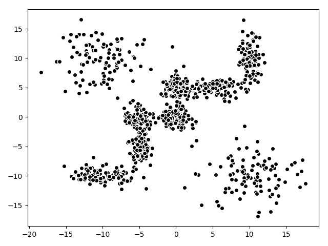
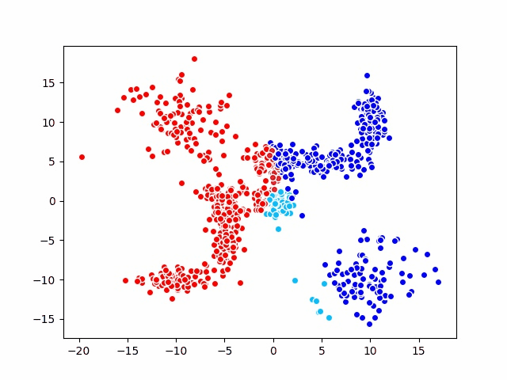

# 批量(batch)版本的SOM

#### 1 优化原理

假设模型中的所有节点都会收敛到一个有序状态，那么当$t\to \infin$时，必有$m_i(t+1)=m_i(t)$，即达到以下状态:
$$
E_t\{h_{c(t),i}(x-m_i^*)\}=0
$$
其中，$h_{c(t),i}$简化为内核函数，即抛弃学习率，只保留邻域半径。$m_i^*$是需要我们求解的满足状态的节点。上式可改写为以下形式：
$$
m_i^*=\frac{\sum_t{h_{c(t),i}x(t)}}{\sum_t{h_{c(t),i}}}
$$
该函数仍然不能精确的求解$m_i^*$，因为$c(t)$仍然取决于全体节点权值$m$。在这里，我们假定一个Voronoi集$V_i\in x(t)$，并定义其为所有靠近节点i的输入的集合（即选中$m_i$作为优胜节点的$x(t)$的集合）；同时定义一个邻域范围，其中所有靠近i位置的节点表示为$N_i$，将两个假设集合合并可以得到新的集合$U_i=V_i\and N_i$。

通俗来说，即对于节点i，其邻域半径内的所有节点集合表示为$N_i$，那么所有选择$N_i$中节点为优胜节点的输入$x(t)$的集合就表示为$U_i$。

于是，利用上述方法，可以将函数进一步改写：
$$
m_i^*=\frac{\sum_{x(t)\in{U_i}}x(t)}{n(U_i)}
$$
其中，$n(U_i)$表示集合中元素的个数。

通过观察可以看出，这个函数表示的内容是，$m_i^*$重新被设定为$U_i$中输入参数的均值。上式可以改写为符合实际运算的方式：
$$
m_i^*=\frac{\sum_{j\in{N_i}}n_j\bar{x_j}}{\sum_{j\in{N_i}}n_j}
$$
其仍然是均值运算。

#### 2 运算过程

1. 初始化$m_i^*$
2. 每次从$x(t)$中选取一个值，找出对应该值的优胜节点$m_i$
3. 令$U_i$表示节点i邻域范围内的所有节点的匹配的$x(t)$的集合，计算并使用$U_i$的均值替换原始$m_i^*$
4. 重复步骤2,直到模型达到稳定状态

#### 3 Python示例

**创建模型**

~~~python
# 新建SOM模型，设置位深为2,图的尺寸为3x3
model = Model(depth=2, width=3, height=3)
# 设置距离算法为欧氏距离
model.distance = euclidean
~~~

**模拟输入分布**

**开始训练**

~~~python
# 初始化学习率，邻域半径
radius = 2.8
while radius > 0.1:
    model.train(X, radius)
    radius *= 0.8
~~~

**训练结果**

