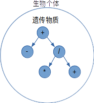

# 遗传编程算法

> **优胜劣汰，适者生存**

[TOC]

## 遗传算法(Genetic Algorithms)

> 遗传算法是一种受生物进化启发的学习算法，模仿生物进化中的**随机变异**，**繁殖**等方法，通过**适应度算法**选择出最适合环境的个体产生后代。
>
> 其算法可以**避免参数落入局部最优解**，但其显而易见的缺点是**执行速度慢**。

### 算法模型

~~~Python
def GA(fitness, fitness_threshold, n, r, m):
    """
    遗传算法模型
    :param fitness: 适应度评估函数，评估每一个个体对环境的适应度
    :param fitness_threshold: 停止进化的适应度阈值
    :param n: number 群体种个体数量
    :param r: replace 每一代种群中被淘汰的比例
    :param m: mutation 基因变异的概率
    :return: float 适应度最高的个体
    """
    # 初始化种群
    group = group_init(n)
    while True:
        # 评估每一个个体的适应度
        fit_score = []
        for unit in group:
            fit_score.append(fitness(unit))
        if max(fit_score) < fitness_threshold:
            # 如果没有产生目标个体
            # 按照概率公式pr选择哪些个体活到下一代，得分越高，活着的概率越大
            alive = select_with_Pr(group, fit_score, n * (1 - r))
            # 根据概率公式pr选择n*r个双亲，产生n*r个后代
            next_generation = generate_with_Pr(alive, n * r)
            # 生成新的种群
            group = alive + next_generation
            # 根据变异系数选择变异个体随机变异
            mutation(group, m)
        else:
            # 返回适应度最高的个体
            return group[argmax(fit_score)]

~~~

### 遗传编程

> 遗传编程(Genetic Programing, GP)是基于遗传算法的自编程算法。

GP操作的程序通常表示为一棵函数树，每个节点表示一种操作。GP通过搜索假设空间，找出当前最符合期待的函数组合，并将得分高的部分交叉生成新的子树。

### 根据给定的输入和输出生成合适的数学表达式

[示例代码见:cccxm/github/deep-learning](https://github.com/cccxm/deep-learning/tree/master/modules/genetic_programing)

#### 操作定义

给定四个数学操作符：加减乘除，GA将从这四个操作中选出合适的组合并输出

~~~python
operators = [
    ('plus', lambda x: x[0] + x[1]),
    ('multi', lambda x: x[0] * x[1]),
    ('minus', lambda x: x[0] - x[1]),
    ('dev', lambda x: [x[0] / x[1] if x[1] != 0 else sys.maxsize][0])
]
~~~

#### 模拟用例

按照以下函数生成6个测试用例
$$
z=\frac{(x-y)^2}{x+y}
$$

~~~python
X = [
    ((0, 10), 10),
    ((1, 9), 6.4),
    ((2, 8), 3.6),
    ((3, 7), 1.6),
    ((4, 6), 0.4),
    ((5, 5), 0)
]
~~~

#### 初始化种群

这里我们定义一个种群只包含n个个体，每个个体的遗传物质由一棵二叉树表示。

~~~python
def generator(n: int) -> list:
    """
    生成初始化节点
    """
    population = []
    for i in range(n):
        random.shuffle(operators)
        nodes = [ProgramingNode(op[0], op[1]) for op in random.sample(operators, 3)]
        nodes[0].left = nodes[1]
        nodes[0].right = nodes[2]
        nodes[1].parent = nodes[2].parent = nodes[0]
        population.append(nodes[0])
    return population
~~~

定义`generator`函数用于初始化种群，定义该种群内共有n个个体。初始化的时候每个个体的遗传物质定义为只包含3个节点的树。

#### 定义交叉算子

> 交叉算子是模拟个体繁殖的算法，用于交换遗传物质，提高物种稳定性

#### 定义变异算子

> 变异算子是模拟生物演化过程中自然发生的变异

~~~python
def mutation(node: ProgramingNode) -> Unit:
    """
    变异
    """
    operator = random.choice(operators)
    n = random.choice(node.to_list())
    n.name = operator[0]
    n.operator = operator[1]
    return node
~~~

#### 定义适应度函数

> 适应度函数的目的是模拟自然选择，不符合自然选择规律的个体将有很大概率被淘汰。

~~~python
def fitness(node: ProgramingNode) -> float:
    """
    适应度
    :param node:
    :return:
    """
    return 1 - min(100, sum([abs(y - node.execute(x)) for x, y in X])) / 100
~~~

这里将适应度调整到0-1的区间内，按照计算差值和实际值的差距的比例计算。

#### 搜索假设空间

~~~python
model = Genetic(100, 0.02, 0.01)
target = model.search(generator, crossover, mutation, fitness, 1.)
print(target.__str__())
~~~

定义种群密度为100,每代的淘汰率为0.02也就是每一代只淘汰两个不符合自然选择规律的个体，变异率设置为0.01,每一代约有1个个体的基因将产生变异。

#### 结果与分析

运行三次得到三个结果

~~~python
# multi:(dev:(minus:plus):minus)
# dev:(minus:dev:(plus:minus))
# multi:(minus:dev:(minus:plus))
~~~

**结果1**
$$
z=\frac{x-y}{x+y}\times(x-y)
$$
**结果2**
$$
z=\frac{(x-y)}{\frac{x+y}{x-y}}
$$
**结果3**
$$
z=(x-y)\times\frac{x-y}{x+y}
$$
通过三次运行结果可以看出，尽管三次结果的形式不同，但都具有一致的数学含义且与预订目标相同。所以遗传编程算法是一种良好的广泛空间搜索算法，而且可能是未来发展自动编码机的首选算法。
