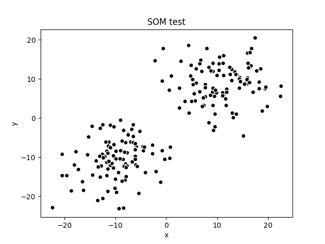
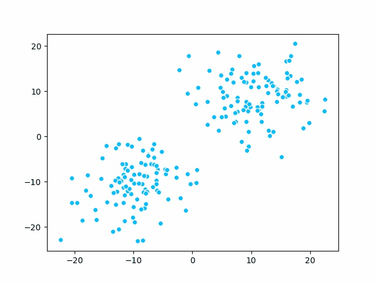

# 增量学习(incremental-learning) SOM算法

[TOC]

## 1. 权值更新算法

对于模型M，假设其有N个节点，每个节点的权重向量(vector)可以表示为$m_i$，输入向量，也被称为观察向量(observation vectors)，表示为$x\in X$ 。类似于WTA算法，每收到一个输入$x$，就对所有节点应用如下更新算法：
$$
m_i(t+1)=m_i(t)+h_{c(x),i}(x(t)-m_i(t)),i\in 1\dots N
$$
其中t表示当前回归步数(regression step)，$x$递归取自样本$X$。$h_{c(x),i}$称为邻域函数。$c(x)$表示获胜节点的位置。

## 2. 优胜算法

从上面的式子可以看出，权值更新算法依赖于获胜节点的位置。SOM算法使用节点遍历的方式找出最接近输入的一个节点：
$$
||x(t)-m_c(t)||\le ||x(t)-m_i(t)||,i\in 1..N
$$
于是，$m_c(t)$被称为在输入是$x(t)$情况下模型中的优胜节点。这里采用欧氏距离度量。

## 3. 邻域函数(neighborhood function)

WTA算法中，每次只选取一个获胜节点进行更新，不需要考虑其他位置。在SOM中，节点采取了更灵活的方式模拟神经元的行动，即一个神经元的活动可以激活或者是抑制周围的神经元。邻域函数就是一种用于选取激活范围和强度的函数。通常选取高斯函数:
$$
h_{c(x),i}=\alpha(t)\exp(-\frac{||r_i-r_c||}{2\delta^2(t)})
$$
其中，$\alpha(t)$是第t次的学习率，$||r_i-r_c||$表示的是第i个位置的节点和优胜节点**在网格图上的距离**。$\delta(t)$是指定邻域的宽度，其随着回归周期单调减小。为了简化运算，高斯函数可以简化为如下形式：
$$
h_{c(x),i}=\begin{cases}\alpha(t),&||r_i-r_c||<\delta(t)\\0,&otherwise\end{cases}
$$
当节点与优胜节点的距离小于设定宽度时，按照学习率更新权值，否则不更新。

## 4. Python示例

**创建模型**

~~~python
# 新建SOM模型，设置位深为2,图的尺寸为3x3
model = Model(depth=2, width=3, height=3)
# 设置距离算法为欧氏距离
model.distance = euclidean
# 设置邻域算法为简化高斯函数
model.neighborhood = gaussian
~~~

**模拟输入**

~~~python
# 创建200个深度为2的随机向量作为输入
X = [(np.random.randn(2) * 5 + 10) for _ in range(100)]
[X.append(np.random.randn(2) * -5 - 10) for _ in range(100)]
~~~

输入的分布大致如下，由于是随机产生，每次结果不尽相同：

**初始化参数并开始训练**

~~~python
# 初始化学习率，邻域半径
alpha = 0.5
radius = 3.0

# 开始训练，直到学习率降低到0.001时结束
while alpha > 0.001:
    for x in X:
        model.train(x, alpha, radius)
    alpha *= 0.9
    radius *= 0.95
~~~

下面给出了训练过程中聚类的变化情况：

