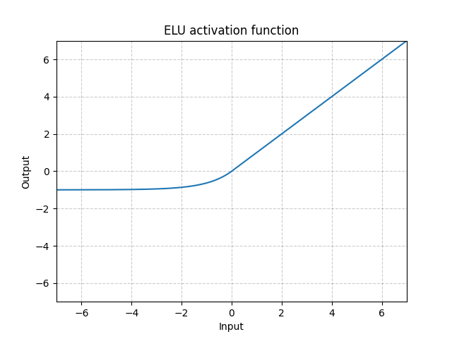
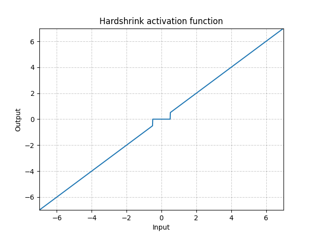
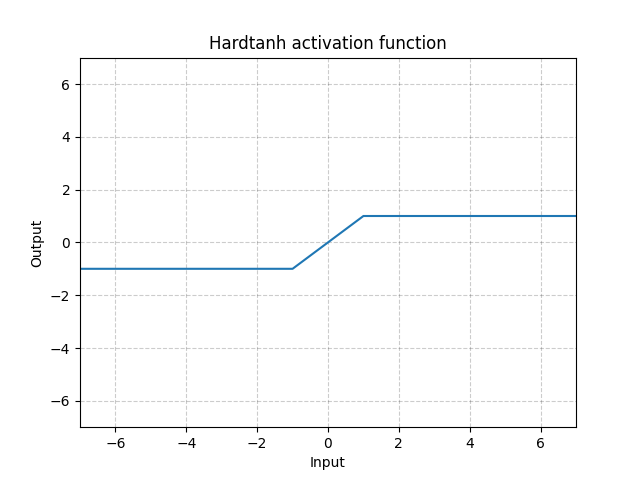
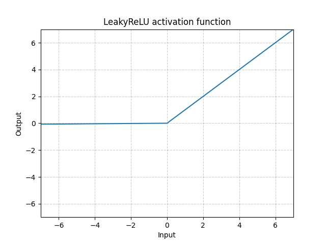
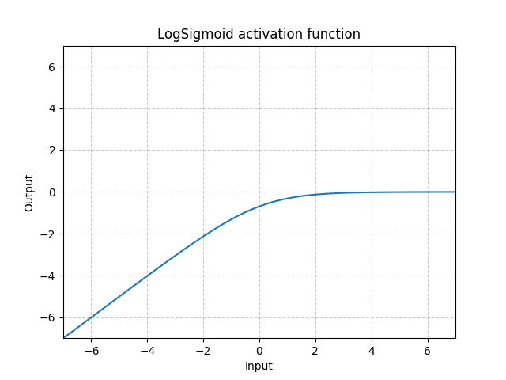

# 非线性激活函数

[TOC]

## torch.nn.ELU

激活函数定义
$$
ELU(x)=\max(0,x)+\min(0,\alpha\times(e^x-1))
$$

ELU可以缓解梯度消失的问题，其存在负值，可以将激活单元的输出均值靠近0。

> 参数列表：
>
> **alpha**: 默认为1.0
>
> **inplace**: 是否使用原地算法，默认为False。若选择True表示直接将计算结果覆盖输入，否则将创建新的对象存放输出结果。

~~~python
import torch

input = torch.tensor([-2, 0, 2], dtype=torch.float32)
m = torch.nn.ELU()
output = m(input)
print(output)
# tensor([-0.8647,  0.0000,  2.0000])

~~~

## torch.nn.Hardshrink

定义
$$
HardShrink(x)=\begin{cases}x,&x>\lambda\\x,&x<-\lambda\\0,&other \end{cases}
$$

> 参数列表：
>
> **lambda**: 默认为0.5

~~~python
import torch

input = torch.tensor([-2, -1, 0, 1, 2], dtype=torch.float32)
m = torch.nn.Hardshrink(1)
output = m(input)
print(output)
# tensor([-2.,  0.,  0.,  0.,  2.])

~~~

## torch.nn.Hardtanh

定义
$$
HardTanh(x)=\begin{cases}1 & x>1 \\ -1&x<-1\\x&other\end{cases}
$$

> 参数列表：
>
> **min_val**: 最小阈值，默认为-1
>
> **max_val**: 最大阈值，默认为1
>
> **inplace**: 是否使用原地算法，默认为False。若选择True表示直接将计算结果覆盖输入，否则将创建新的对象存放输出结果。

~~~python
import torch

input = torch.tensor([-2, -1, 0, 1, 2], dtype=torch.float32)
m = torch.nn.Hardtanh(1)
output = m(input)
print(output)
# tensor([-2.,  0.,  0.,  0.,  2.])

~~~

## torch.nn.LeakyReLU

定义
$$
LeakyRELU(x)=\begin{cases}x,&x>=0\\negative\_slope\times x,&other\end{cases}
$$

> 参数列表
>
> **negative_slope**: 负值权重控制
>
> **inplace**: 是否使用原地算法，默认为False。若选择True表示直接将计算结果覆盖输入，否则将创建新的对象存放输出结果。

~~~python
import torch

input = torch.tensor([-2, -1, 0, 1, 2], dtype=torch.float32)
m = torch.nn.LeakyReLU(0.5)
output = m(input)
print(output)
# tensor([-1.0000, -0.5000,  0.0000,  1.0000,  2.0000])

~~~

## torch.nn.LogSigmoid

$$
LogSigmoid(x)=\log(\frac{1}{1+e^{-x}})
$$

~~~python
import torch

input = torch.tensor([-2, -1.5, -1, -0.5, 0, 0.5, 1, 1.5, 2], dtype=torch.float32)
m = torch.nn.LogSigmoid()
output = m(input)
print(output)
# tensor([-2.1269, -1.7014, -1.3133, -0.9741, -0.6931, -0.4741, -0.3133, -0.2014,
#         -0.1269])

~~~

